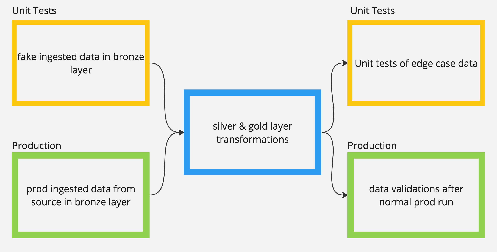

# Databricks: Unit Test Example

This repo shows how to set up unit tests that can run as part of checks
that the queries are defined to meet business rules.

## Design

The silver and gold layers will be run as part of the unit tests.  The
bronze layer in the unit tests is fake data that test the edge cases.
After the silver and gold layers queries run a set of expectations are
run to test that the business rules are met.

Based on this [databricks example](https://notebooks.databricks.com/demos/dlt-unit-test/index.html)

**Diagram of Notebooks**

## Pipeline Deployment & Run

The pipelines are set up to be run manually or to be run as a workflow in github actions.

In this repo, the github action triggers when a merge into master happens.  This seems
to be the most functional because the databricks job will take time and also require
spinning up databricks compute instances.  It will help to ensure that the unit tests
are run before code goes into master but also keeping costs low.

The databricks bundle is designed to run a job which has two tasks.  The first task runs
the DLT pipeline and then on success the second task runs to clean up the tables and schema
that were created by the DLT pipeline.  An individual can run the databricks bundle, then
check the DLT pipeline run for the success of the unit tests, and finally destroy the jobs and pipeline.

- run `databricks bundle deploy` : just command `just bundle-deploy`
- run `databricks bundle run` : just command `just bundle-run`
- run `databricks bundle destroy` : just command `just bundle-destroy`

## SQL Validation

Included in the code base is a python script that connects to the databricks instance
and parses the event logs to report on failed expectations. The command that
can be run is `just sql-validations`.  Additionally, there are
some unit tests on the code that can be run with `just pytest-unittest`.

## Local Dev Set Up

#### Databricks-CLI

The commands to set up the pipelines use `databricks-cli`.  You can brew install:
[link to install instructions](https://docs.databricks.com/en/dev-tools/cli/tutorial.html#databricks-cli-tutorial).
You will need to follow the instructions
to set up an access token which will be added to your local setup through the `databricks-cli`.

#### Justfile

`.justfile` for common commands. [just github](https://github.com/casey/just?tab=readme-ov-file#installation)

#### pre-commit

`pre-commit` : isort and black formatting when creating a commit
