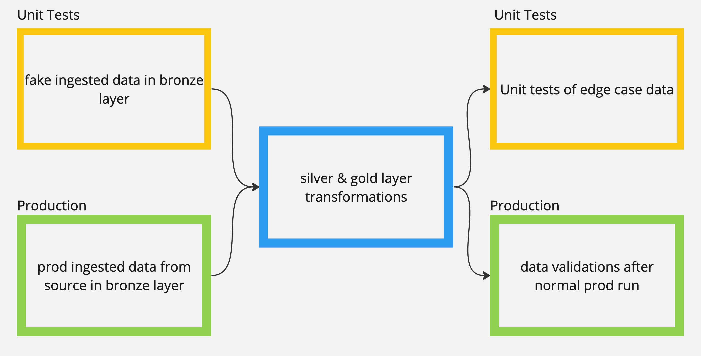

# Databricks: Unit Test Example

This repo shows how to set up unit tests that can run as part of checks
that the queries are defined to meet business rules.

## Design

The silver and gold layers will be run as part of the unit tests.  The
bronze layer in the unit tests is fake data that test the edge cases.
After the silver and gold layers queries run a set of expectations are
run to test that the business rules are met.

Based on this [databricks example](https://notebooks.databricks.com/demos/dlt-unit-test/index.html)

**Diagram of Notebooks**

## Pipeline Deployment

To create the pipeline, you can use the json file in `pipeline_code` as a template.
The databricks cli command is:
`databricks pipelines create --json @dlt_pipeline_configuartion/cluster_test.json`

## Local Dev Set Up

`.justfile` for common commands. [just github](https://github.com/casey/just?tab=readme-ov-file#installation)

`pre-commit` : isort and black formatting when creating a commit
